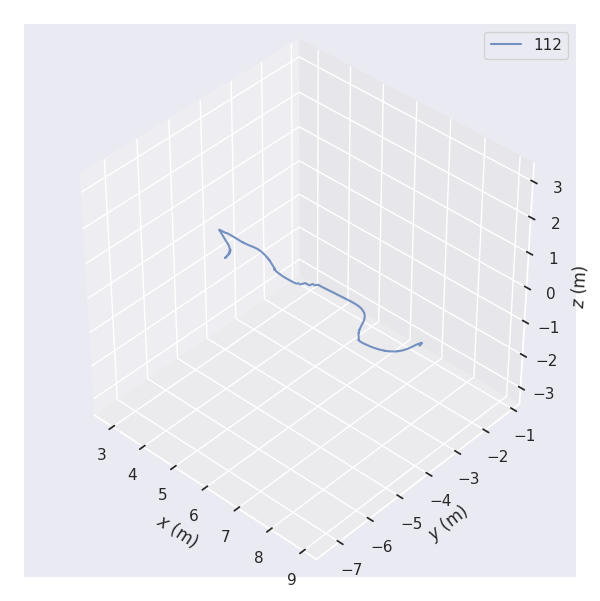

---

#  How to use
1. bringup
```
./bringup.sh
```
2. pull log file and generate result
```
./generate_result.sh
```

---

## 1 Test camera
```cpp
./image_follow_line USB_video_front USB_video_back P_param I_param Velocity
```
example
```cpp
./image_follow_line /dev/video0 /dev/video2 0.18 0.005 0.5
```
speed & PID parameter

|P|I|D|V|
| ---- | ---- | ---- | ---- |
|0.18|0.005|0|0.5|
|0.32|0.005|0|0.75|

## 2 control the pdrobot
``` cpp
ls /dev/ttyACM0
sudo chmod 777 /dev/ttyACM0
roscore

```

## 3 How to get log from android

```cpp
adb connect pudurobot-IP
adb shell
cd sdcard/name/log
adb pull /sdcard/name/log/log_name
ppmd -d input_file.pdlog output_file.log  (you need install ppmd file to /usr/bin)
```

## 4 How to generate path data txt file

```cpp
cd root/script
python getpose.py path_log.log
```

## 5 How to use evo to draw trajectory

``` cpp
evo_traj tum path_txt.txt  -p --plot_mode=xyz
```



